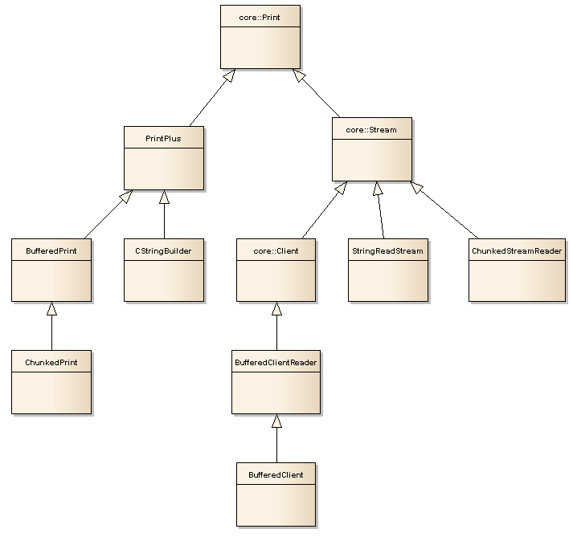

<a href="https://www.buymeacoffee.com/jurajandraY" target="_blank"></a>

# StreamLib

## Buffering and flush()

In Arduino world there was a confusion about the flush() function. Some libraries implement it to discard the incoming bytes, reading them without storing. But decades is the flush() function in C, C++, Java used in conjunction with output buffering. To not to send every small piece of data over a connection with overhead of protocol bytes like network protocols (TCP, UDP) or IC communication protocol (I2C, SPI) we need buffering. Data are collected until the buffer is full and then the collected data are send and the buffer is ready for next bytes. And the flush() functions sends the buffer even if it is not full, but we do not have more data. So buffering without the right flush() function is not possible and many arduino libraries suffer of slow communication because the authors didn't use buffering. The flush() dilemma is resolved and in Arduino core classes the flush() method is declared in Print class which is the Arduino standard interface for output streams.

This library offers a BufferedPrint class which wraps the target stream and buffers the data to be send over the target stream. Of course, do not forget to use flush() after last data printed.

The BufferedPrint doesn't call flush() on underlying target stream, because if the target stream has the wrong flush implementation, it could throw away the response of your request.

## HTTP data length

It is common practice in Arduino sketches to not to send the Content-length header with HTTP responses and POST requests. In most cases it is because when the HTTP headers are send, the size of data is not known. The browser or WebServer then doesn't know if it received all the data and waits until the connection is closed or timeout is reached. It leads to long time until the page is shown in browser or long time until a Web Server sends the response to requesting Arduino sketch.

This library offers two solutions to this problem. If the data can be prepared to a string in memory, the CStringBuilder is the way. Prepare the string and use CStringBuilder's getLength() to fill the Content-length HTTP header.

If the data to be send as response or in POST request wouldn't fit into available memory, ChunkedPrint can be used with HTTP chunked Transfer-Encoding. And ChunkedPrint is an extension of BufferedPrint so your page shows up in browser quickly and the Web Server handles your request without hesitating. 

## Decode HTTP chunked transfer encoding

A HTTP server can send data with "Transfer-Encoding: chunked". This format has chunk sizes mixed into returned data.

The ChunkedStreamReader class can decode this format and provide the original data sent by the server. See ChunkedReadExample and Advanced/ReadChunkedJSON examples.

ChunkedStreamReader has a function `chunkedAvailable()`. This will return the number of bytes remaining to read from current chunk. It will be larger than zero until end of the data is reached (the 0 terminating the chunked encoding). 

While the size of the chunk is known, the data of the chunk may be not received yet. The standard `available()` function returns count of bytes available for immediate read. In ChunkedStreamReader `available()` returns `min(chunkedAvailable(), input.available())` because input.available() may count bytes filtered out by ChunkedStreamReader.


## Formatted printing

The Arduino Print class for AVR doesn't have [printf function](http://www.cplusplus.com/reference/cstdio/printf/). The reasons for [not adding them](https://github.com/arduino/Arduino/pull/5938) are unknown. The Arduino esp8266 core has them. To fill this gap, the classes of this library have a common base class PrintPlus which extends the core Print class with two printf methods, one for formatting string from RAM and second for formatting string wrapped into F() macro for use from program memory.

If you send a stream to a function and the function benefits from printf, use PrintPlus as a parameter type. The function then can use the printf methods and you can call the function with BufferedPrint, ChunkedPrint or CStringBuilder.

```
void eventsPrintJson(PrintPlus& stream, int ix) {
  stream.printf(F("{\"i\":%i,\"t\":%lu,\"v1\":%d,\"v2\":%d,\"c\":%u}"), ix, events[ix].timestamp, events[ix].value1, events[ix].value2, events[ix].count);
}
```
## Copy bytes or characters from a Stream

The PrintPlus class has functions to copy from a Stream class object. Examples of types inherited from Stream are HardwareSerial, SoftwareSerial, File, EthernetClient, WiFiClient, ...

Example:
```
  response.copyAvailableFrom(file);
  response.flush();
  file.close();
  if (response.getWriteError()) {
    Serial.println("write error");
  }
``` 

There is a pair of functions copyFrom and copyFromUntil which wait for the next byte until timeout (set on the source Stream) and a copyAvailableFrom functions which copies only data immediately available without blocking.
```
  uint32_t copyFrom(Stream& stream, uint32_t limit = 0)
  uint32_t copyFromUntil(char terminator, Stream& stream, uint32_t limit = 0);
  uint32_t copyAvailableFrom(Stream& stream, uint32_t limit = 0)
```
parameters:
* `stream` is the source stream
* `terminator` is a character on which the reading stops. the character will not be copied but will be removed from the source stream (same as Stream::readBytesUntil and Stream::readStringUntil)
* `limit` is the maximum count of bytes/characters to copy. it is an optional parameter. 0 means unlimited.

Return value is the count of copied bytes. 

## Providing string where Stream is required

The StringReaderStream class can wrap a string or String into a Stream implementation. The string can be in PROGMEM. This allows to provide a string where Stream is required. For example it can be used to feed data from PROGMEM to libraries  where PROGMEM string is not supported, but an implementation to read a Stream is provided.

The ChunkedReadExample uses StringReaderStream to simulate a network client.

## Reading networking Client with buffer

Many networking libraries don't buffer the read from the networking shield or module over SPI. It is more efficient to read more bytes at once than requesting a couple of bytes many times.

The timed and parsing functions of Stream use byte by byte reading and networking libraries without read buffering then request one byte at time over SPI.

The BufferedClientReader class can help to speed up reading of data received from network by the networking shield or module. BufferedClientReader uses Client::read(buff, size) method to read at once as much available bytes as possible into the buffer, then serves the bytes from the buffer until the buffer is empty and then at next read it again requests the data into the buffer.

Example of creating BufferedClientReader over networking Client:
```  
uint8_t buffer[32];
BufferedClientReader bc(client, buffer, sizeof(buffer));
```
BufferedClientReader implements the Client base class so it can be used where Client is required while it wraps the true network client object.
```
EthernetClient ethClient;
uint8_t buffer[32];
BufferedClientReader bcr(ethClient, buffer, sizeof buffer);
HttpClient client(bcr, server, 80);
```

## Printing to two outputs at once a.k.a 'tee'

The TeePrint class allows to print to two outputs at once. It inherits from PrintPlus so printf and mass copy functions are available. 

Example:
```
TeePrint tee(Serial, TelnetStream);
``` 

## Comments

Install the library in Library Manager and you can find basic examples in Examples menu in IDE.

For some real-sketch examples see my Regulator project: [WebServer.ino](https://github.com/jandrassy/Regulator/blob/master/Regulator/WebServer.ino) for Web and REST server; [WemoInsight.ino](https://github.com/jandrassy/Regulator/blob/master/Regulator/WemoInsight.ino) for SOAP XML HTTP request.

## Print and Stream class hierarchy

### Common classes


### StreamLib classes




 